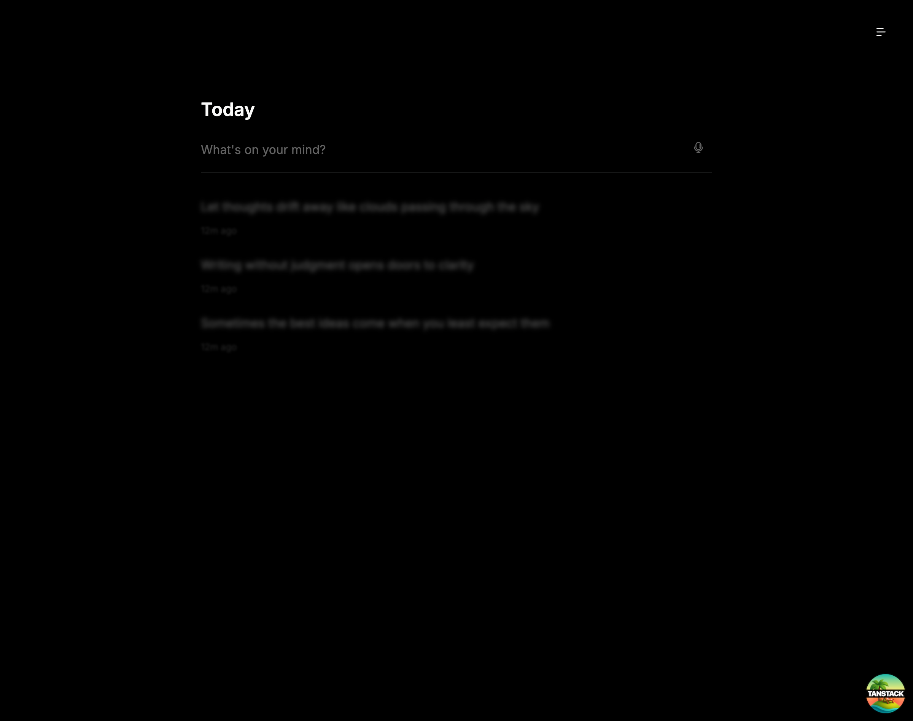

# Drift

A stream of consciousness writing app. Capture thoughts as they come, watch them fade into the background, and revisit them whenever you need.

<picture>
  <source media="(prefers-color-scheme: dark)" srcset="screenshots/dark.png">
  <source media="(prefers-color-scheme: light)" srcset="screenshots/light.png">
  
</picture>

## About

Drift encourages raw, unfiltered writing by letting your thoughts gradually blur and fade after you write them. This creates space for new ideas while keeping everything accessible when you hover or search.

Thoughts remain editable for 5 minutes. After that, they're preserved as-is, allowing you to return later and trace your thought process without the temptation to endlessly revise.

## Features

**Writing** - Press Enter to capture a thought. Use the microphone for voice input.

**Fading** - Thoughts blur and fade over a few seconds, encouraging you to keep moving forward rather than editing.

**Reveal** - Hover over any thought to instantly reveal it.

**Search** - Press Cmd+F to search through all your thoughts.

**Persistence** - Everything is saved locally in your browser.

**Themes** - Press T to toggle between dark and light mode.

## Stack

- [TanStack Start](https://tanstack.com/start) with React 19
- [Tailwind CSS](https://tailwindcss.com) v4
- [shadcn/ui](https://ui.shadcn.com) with Base UI primitives
- TypeScript

## Development

```bash
bun install
bun run dev
```

## Keyboard Shortcuts

| Key | Action |
|-----|--------|
| Enter | Submit thought |
| T | Toggle theme |
| Cmd+F | Search thoughts |
| Backspace | Delete empty thought |
| Escape | Cancel editing |

## License

MIT
